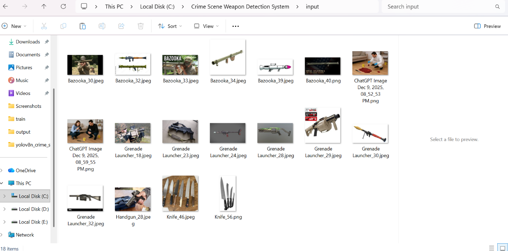
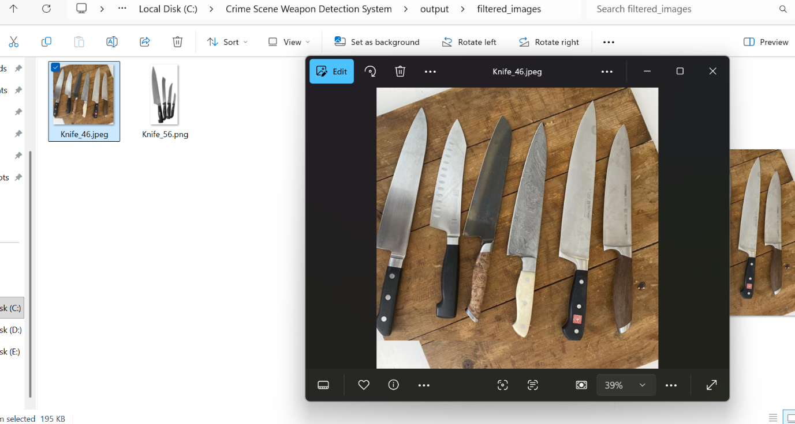
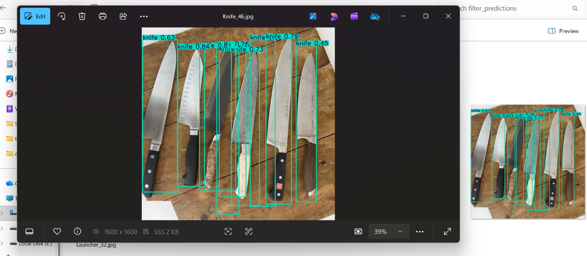

# 🔫 Automated Weapon Detection System

## 📌 Overview
This project is an AI-based system for detecting weapons in forensic images using YOLOv8. It helps investigators automatically filter relevant evidence from large datasets.

## 🚀 Features
- Weapon detection using YOLOv8
- Supports image-based detection
- Displays bounding boxes with confidence scores
- Automated evidence filtering concept

## 🧠 Tech Stack
- Python
- YOLOv8 (Ultralytics)
- OpenCV
- NumPy

## ⚙️ How to Run

```bash
pip install -r requirements.txt
python detect.py
## 📸 Output Results

### 🖼 Input Image


### 🔍 Detection Output


### ✅ Annotated Result

